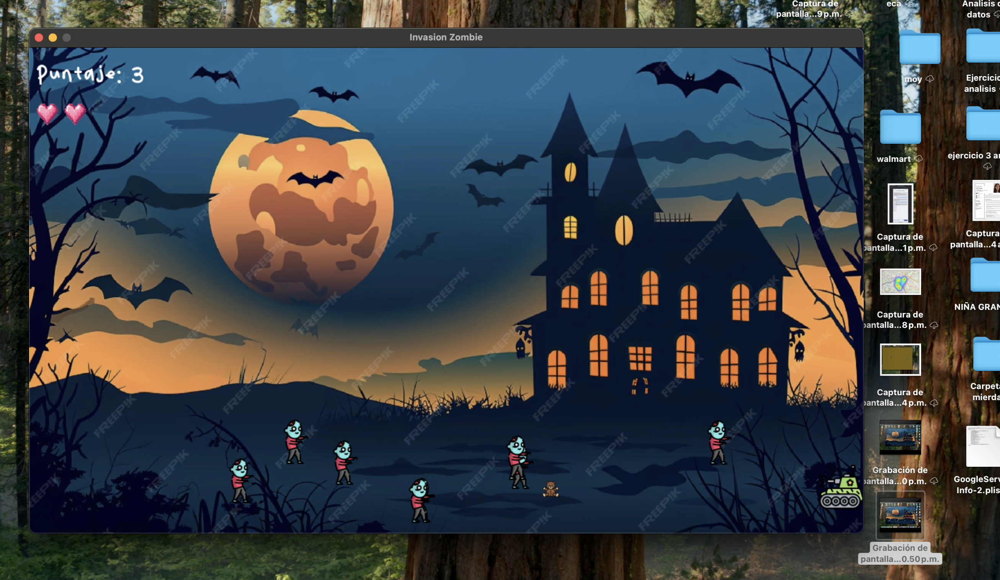

# 🧟‍♂️ Invasión Zombie

<p align="center">
  
</p>

<p align="center">
  🧸💥 Dispara ositos • 🧟‍♂️ Sobrevive • 🏆 Rompe tu récord
</p>

---

## 🚀 Sobre el proyecto

**Invasión Zombie** es un juego 2D desarrollado con **Python y Pygame**, donde controlas un tanque que debe sobrevivir a oleadas de zombies.

Pero no es un juego cualquiera...

👉 Aquí eliminas enemigos **disparando ositos de peluche** 🧸

---

## 🎮 Gameplay

- 🧟‍♂️ Zombies aparecen constantemente en la pantalla  
- 🧸 Puedes disparar múltiples proyectiles  
- ❤️ Tienes un sistema de vidas  
- 🏆 Ganas puntos al eliminar enemigos  
- ☠️ Si pierdes todas tus vidas → GAME OVER  

---

## 🕹️ Controles

| Tecla | Acción |
|------|--------|
| ⬅️ ➡️ | Mover en horizontal |
| ⬆️ ⬇️ | Mover en vertical |
| SPACE | Disparar ositos 🧸 |

---

## 🧠 ¿Cómo funciona?

El juego utiliza lógica de colisiones basada en distancia:
d = √(x1 - x2)² + (y1 - y2)² 


Si la distancia es menor a cierto valor → 💥 colisión detectada.

---

## 🛠️ Tecnologías

<p>
  
  
</p>

---

## ⚙️ Features

✨ Movimiento libre del jugador  
✨ Sistema de múltiples enemigos  
✨ Disparos múltiples  
✨ Sistema de vidas ❤️  
✨ Sistema de puntaje 🏆  
✨ Música de fondo 🎵  
✨ Efectos de sonido 🔊  

---

## ▶️ Cómo ejecutar

```bash
pip install pygame
python juego.py
